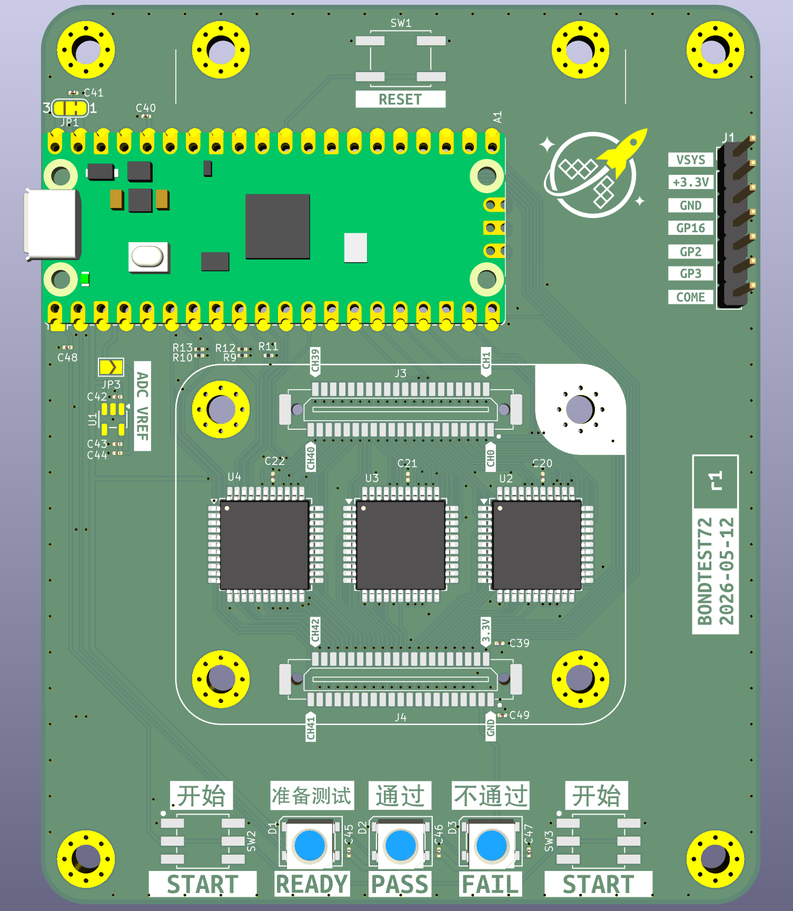

# BondTest72

Production test fixture board for bond wire testing, controlled by a Raspberry Pi Pico.
Test signals are routed through CH446X analog crosspoint switches to two 41-pin connectors, on which a replaceable adapter board sits. The adapter board carries the DUT connector and any auxiliary components, keeping the main tester board from wearing out.

## Specifications

| Parameter | Value |
|-----------|-------|
| Revision | r1 |
| Date | 2026-05-12 |
| Board size | 80 × 100 mm |
| Layers | 4 (F.Cu / In1.Cu / In2.Cu / B.Cu) |
| Thickness | 1.6 mm FR4 |

## Power

The board is powered from the Pico's USB VBUS rail. The TPS7A0533 LDO provides an optional quiet +3.3VADC rail as an alternative ADC reference, in case the main +3.3V rail from the Pico's onboard DCDC is too noisy. In practice the application only requires ~0.1 V accuracy, so the main rail is likely sufficient.

## Operator Interface

Two push button footprints are provided; only one is populated. The three SK6812 RGB LEDs serve as status indicators.

## Signal Routing

Four CH446X analog crosspoint switches fan test signals out from the Pico GPIO/ADC lines to the 41-pin connectors (J3 / J4). These connect to a removable **adapter board** rather than directly to the DUT. The adapter board carries the DUT-side connector (the high-wear part) and any auxiliary components needed for a given test configuration — for example, diodes for self-testing or a small memory chip for wear-cycle monitoring. Replacing the adapter board instead of the whole fixture avoids discarding the tester after the DUT connector wears out (~100 cycles). Solder jumpers on the main board provide flexibility to work around any schematic design flaws discovered after fabrication.

## Files

| File | Description |
|------|-------------|
| `BondTest72.kicad_pro` | KiCad project |
| `BondTest72.kicad_sch` | Schematic |
| `BondTest72.kicad_pcb` | PCB layout |
| `docs/BondTest72-schematic.pdf` | Schematic PDF export |
| `lib.kicad_sym` | Project symbol library |
| `lib.pretty/` | Project footprint library |
| `df9.pretty/` | Additional footprint library |
| `production/` | Gerber/fabrication outputs |
| `docs/` | Board renders and documentation images |
